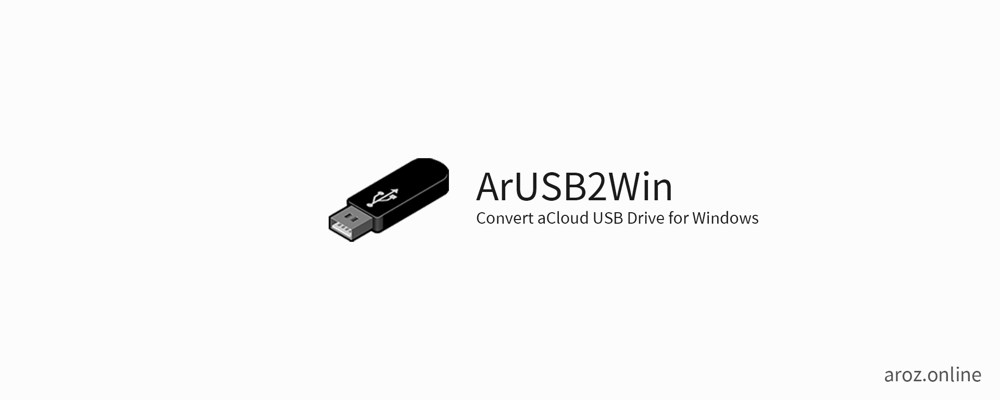
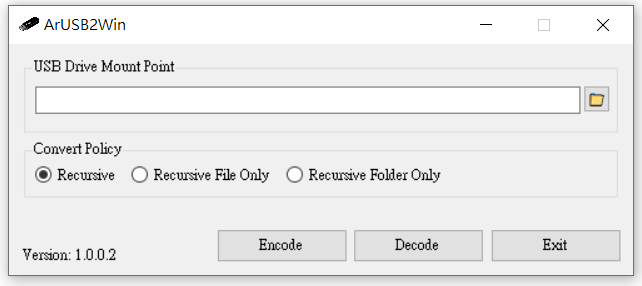

# ArUSB2Win

ArOZ 隨身碟 UM檔名 到 Windows 檔名轉換器 -
這是一個能把 ArOZ 文件系統裡面使用的 UM檔案命名法轉換成一般 Windows 主機可讀的檔名的簡易工具。

要使用此工具，你只需下載 exe執行檔，選擇隨身碟的位置（例如F：\或G：\）或任何子目錄，然後按“解碼”即可。
這將會在 Windows 作業系統上將所有文件名和文件夾遞歸解碼為可讀的文件名。

如果要將隨身碟重新安裝到ArOZ在線系統中，你需要選擇隨身碟的位置，然後按“編碼”。
完成後把隨身碟重新插入ArOZ主機設備，您即會看到所有文件名均已正確讀取。

## 下載
請參閱 [release list](https://github.com/aroz-online/ArUSB2Win/releases)。
## 預覽

## 協助開發
請參閱英文版本的 Collabration 項目。

## License
根據MIT許可證分發。 有關更多信息，請參見授權檔（LICENSE）。

**fsconv 執行檔並不屬於本開源項目。然而我們已獲得了fsconv 開發者同意把 fsconv 二進製文件嵌入本工具**

**The fsconv is not part of the project. However, we got permission to open source our tool with the fsconv binary included**

## 聯絡我們
你可以在這裡找到我們：[傳送門](https://www.facebook.com/ImusLaboratory/)。
